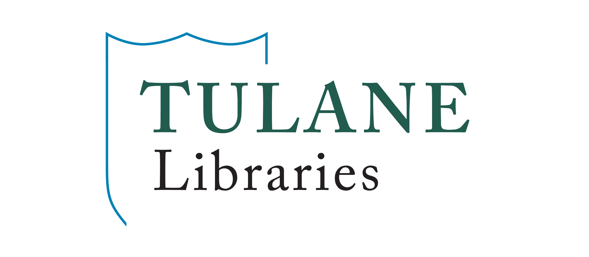

# Intro to R, Part II: Projects, Packages, Processing, Plots

Welcome! This tutorial from Tulane University's Howard-Tilton Memorial Library is the second half of an Intro to *R* workshop. It is targeted towards faculty, post-docs, graduate students, and undergraduates new to *R*. It's goal is to teach you the *R* coding skills you're likely to need for every coding endeavor.

In part I, you learned the fundamentals of *R* and built a foundation for working with your own data. In this second installment, you'll learn to streamline project management, incorporate packages to increase functionality, code more efficiently in the tidyverse dialect, implement more complex conditional and iterative processes, group and summarize your data, and visualize your results with figures.

# To access the tutorial in your web browser, head here:   <https://mellisbirds.github.io/Intro_to_R_part2/R_intro_part2.html>

Happy coding!
