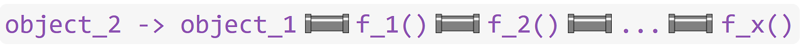

{fig-align="center"}

Welcome! This tutorial was commissioned by Tulane University's Howard-Tilton Memorial Library as the second half of an Intro to R workshop. It is targeted towards faculty, post-docs, graduate students, and undergraduates new to R. In part I, you learned the fundamentals of R and built a foundation for working with your own data. In this second installment, you'll learn to streamline project management, incorporate packages to increase functionality, code more efficiently in the "tidy" dialect, implement more complex conditional and iterative processes, summarize and analyze your data, and visualize your results with figures.

Happy coding!

<br>

# **Projects**

## Create your first project

**Projects** are convenient places to store all of the files associated with whatever it is you're working on in *RStudio*. Bundling up files in projects tends to improve your organizational efficiency, and it streamlines the normal, everyday hassle of importing data and exporting product. Projects are also easily shared with collaborators and save them the headache of replacing your local file paths with their local file paths.

::: callout-tip
## <font size="5"> Try it </font>

<font size="4"> Create a new project to manage materials for this tutorial. </font>
:::

-   *RStudio* Really encourages you to use projects, giving you three easy options to start one. Simply choose "New Project..." from the File drop-down menu, or click one of these two buttons:


-   When creating a new project, you have the option of putting it in a pre-existing folder, in which case it will take the name of that folder, or creating a new folder with the same project name. (You may also see an option to start a new project with version control, which is a more advanced feature beyond the scope of this tutorial).

::: callout-note
## <font size="5"> Note </font>

<font size="4"> This is more advanced, but if you're active on GitHub or hope to be someday, then you'll come to love R projects for smoothly translating to GitHub repositories and vice versa! </font>
:::

-   Choose "New Directory" and then "New Project" to create a folder/project somewhere that makes sense for you. Give it a meaningful but short name like "Intro_to_R\_part2". Don't check any of the optional boxes for now.

-   I recommend keeping your R project folders as organized as possible so you can navigate quickly and share clean work spaces with collaborators since sharing science often means sharing scripts, data, and R output like figures. You may want to consider adding some sub-folders to your project Here's what my setup looks like for this lesson (and most of my R projects):


-   Now that you've created a project, you can always access it using the Project drop-down menu in the right side of *RStudio*. The menu will display the currently open/active project. Check to make sure your project for this tutorial is open to ensure functionality of upcoming code.

-   You can directly access files and folders in your open project through the Files tab in *RStudio*. Very convenient!

## Add R script to project

Great! Now that you've got a project up and running, start a new R script for this tutorial. You can do so using the New File button in the top left, the File drop-down menu, or -- a new option -- the "New Blank File" drop-down menu under your Files tab.


## Add data to project, import

We'll need some data to work on for this tutorial. Let's use the data we created in Part I of this tutorial. If you don't have it handy, you can download it directly from the web using `download.file()`.

When you're working in a Project, R automatically sets it as your working directory! That means you don't have to type out the entire path to access your project folder or the files therein.

::: callout-tip
## <font size="5"> Try it </font>

<font size="4"> Enter the following code into your new script to download data from the web and directly into your project directory. Then, import it. </font>
:::


::: {.cell}

```{.r .cell-code}
# Setup ----

# First, take a quick look at the help file for download.file()
?download.file

# NOTE: download.file() takes several arguments. We're most concerned with the url, or address of the hosted file for download, and "destfile", or the destination and name you'd like to give the downloaded file.

# NOTE: All of these arguments are text strings and therefore belong in quotations.

# NOTE: You MUST provide a file type in your desired file name (in this case, .csv).
```
:::


You may need to slightly alter the `destfile =` argument depending on whether or not you'd like to store these data in a project sub-folder.


::: {.cell}

```{.r .cell-code}
# I have a sub-folder in my project called "Data_In" and therefore need to specify that location before my chosen file name.
download.file(url = "https://libguides.tulane.edu/ld.php?content_id=71000172", destfile = "Data_In/intro2_bird_data.csv")

# If you don't have a similar sub-folder, you only need to provide destfile with a file name. It will automatically save to your project folder.
download.file("https://libguides.tulane.edu/ld.php?content_id=71000172", "intro2_bird_data.csv")
```
:::


These data should now appear in your *RStudio* files pane. Let's go ahead and import them.


::: {.cell}

```{.r .cell-code}
# Importing data
# Remember to insert or drop a sub-folder as needed.
# This code says "I will create an object named `birds` and assign to it the data contained in the following .csv file stored in my project or specified project sub-folder."
birds <- read.csv("Data_In/intro2_bird_data.csv")
```
:::


Don't forget to scope out your data after importing! I'd recommend entering `View()` into your console. And remember, you've also got...


::: {.cell}

```{.r .cell-code}
head(birds)
tail(birds)
str(birds)
```
:::


# **Packages**

In this tutorial, we're going to do some more complex data munging and analyses requiring specialized functions not included in base *R*. **Packages**, or **Libraries**, are open-source bundles of pre-coded functions (and oftentimes data) that we can install and access in *RStudio* to suit our own needs.

One of the most popular *R* packages is called `tidyverse`. It's actually a collection of packages geared towards making your life *much* easier...at least when it comes to data work. To access it, you need to install it (once) and then load it (once per session when re-opening *RStudio*).

## Installing

::: callout-tip
## <font size="5"> Try it </font>

<font size="4"> Install and load `tidyverse` packages, also known as libraries. </font>
:::

You can view all the packages in base *R* and all the packages you've ever installed by clicking the Packages tab in the *RStudio* pane including your Files and Plots tabs. Do so now, and underneath the tab names, you'll see buttons to Install and Update packages.

::: callout-warning
## <font size="5"> Are you online? </font>

<font size="4"> Most packages are hosted online by *CRAN, The Comprehensive R Archive Network*, so naturally you'll need an internet connection to download and install them! </font>
:::

Click that "Install" button at the top of the pane, type in `tidyverse` in the Packages bar, make sure the "Install Dependencies" box is **checked**, and select the "Install" option in the pop-up window. (For most users, the default library path to install to is a perfectly good option). *RStudio* will then take care of the rest, showing you its progress in your Console pane.

{width="811"}

::: callout-note
## <font size="5"> Note </font>

<font size="4"> Packages are occasionally updated by their creators, often to maintain functionality when *R* or *RStudio* are updated. As a result, you'll have to update your software and/or packages every now and then. When the time comes, you'll typically get warnings from *RStudio* while loading or installing new packages. You can use the Update button at the top of the Packages tab to take care of business. </font>
:::

## Loading

The nice thing about installing packages is that you generally only have to do it once. To *access*, a package, however, you have to tell *RStudio* to open it every time you start a new session. Fortunately, that's quick and easy too. All you have to do is plug the desired package into the `library()` function.

::: callout-note
## <font size="5"> Note </font>

<font size="4"> It's good practice to put code to load libraries, aka packages, in the very beginning of your *script*, not your console! Loading all your required packages up front, not buried halfway through your document can save you and your collaborators from package conflicts down the road. </font>
:::


::: {.cell}

```{.r .cell-code}
# Running library(tidyverse) allows you to access data and functions from the collection of packages that make up the tidyverse.
# Put this somewhere near the top of your script in your Setup section.
library(tidyverse)
```

::: {.cell-output .cell-output-stderr}
```
── Attaching core tidyverse packages ──────────────────────── tidyverse 2.0.0 ──
✔ dplyr     1.1.0     ✔ readr     2.1.4
✔ forcats   1.0.0     ✔ stringr   1.5.0
✔ ggplot2   3.4.1     ✔ tibble    3.2.0
✔ lubridate 1.9.2     ✔ tidyr     1.3.0
✔ purrr     1.0.1     
── Conflicts ────────────────────────────────────────── tidyverse_conflicts() ──
✖ dplyr::filter() masks stats::filter()
✖ dplyr::lag()    masks stats::lag()
ℹ Use the conflicted package (<http://conflicted.r-lib.org/>) to force all conflicts to become errors
```
:::
:::


See those Conflict messages? Those show up because different package creators sometimes use the same word when naming functions with different applications. When calling a function with a conflicting name, e.g., `filter()`, *RStudio* will automatically use the version of the function from the most recently loaded library, in this case `dplyr`, which is part of `tidyverse`. If you want to use a different version of the function in your script, you can specify it by putting the package name in front of two colons and the function title, e.g., `stats::filter(your_data_here)` will override `filter(your_data_here)` from the `dplyr` package after loading `tidyverse`.

# **Welcome to the Tidyverse**

## About

Great! You can now use the `tidyverse` to create and process "tidy" data, which boils down to making sure your data are organized with one value per cell and one cell per column and row. Storing your data this way greatly streamlines munging and analysis workflows.

The `tidyverse` has a lot of strengths over base *R*. The most obvious of which that you can benefit from almost immediately are that it...

1.  reduces repetitive wordiness (like constantly having to supply your data and your data\$column names) while...
2.  simultaneously targeting user-specified data in dynamically moving data sets.
3.  And on top of that, it allows you to quickly and clearly string together functions in an obvious order without having to constantly create and reference new objects or wrap 10 functions inside of one another! More on this in the **pipes** section below.

Here are the `tidyverse` packages you now have access to and their basic purposes. When you're working with your own data and come across a complex roadblock, see if your situation can be solved by the tools in one of these packages:

-   `tidyr`
    -   Tools for reshaping your data to make it tidy. Too many values in a cell? Should your rows be columns or vice versa? This is how you get your data to where it needs to be for analysis.
-   `dplyr`
    -   Common data manipulation tools for making changes to a single data set and/or comparing and combining multiple data sets.
-   `stringr`
    -   A great toolbox for working with strings, aka non-numeric character data. Find, replace, mutate, subset, combine/separate and more.
-   `ggplot2`
    -   The gold standard for creating beautiful plots and figures in *R*.
-   `purrr`
    -   Powerful tools for applying functions to multiple vectors, columns, or lists of data at once.
-   `forcats`
    -   Tools for working with **factor** variables, i.e., categorical data like treatment or forest type.
-   `tibble`
    -   Functions for working with **tibbles**, which are what the `tidyverse` calls its new and improved versions of data frames. They're largely interchangeable and conversions happen behind the scenes, so you generally don't need to worry about it. If you see tibble, think data frame.
-   `readr`
    -   For importing tabular data in more exotic or complicated formats.

::: callout-note
## <font size="5"> Note </font>

<font size="4"> To learn more about tidy data and the `tidyverse`, explore the resources available at <https://www.tidyverse.org/learn/> and the [RStudio cheatsheets](https://posit.co/resources/cheatsheets/?type=posit-cheatsheets&_page=2/) for `tidyverse` packages. </font>
:::

## Popular `tidyverse` functions

`tidyverse` functions work pretty much the same as functions from base *R*. Supply a function with data, feed it any necessary arguments, and put the result into a container object:

`object -> my.function(data, argument = desired_manipulation)`

Below we'll create a smaller data frame to test functions on, making sure not to overwrite it (meaning don't set it equal to anything with `<-`). This way, changes we make aren't stored and we can continue to manipulate the smaller test object, getting expected -- but *temporary* -- results every time.

::: callout-tip
## <font size="5"> Try it </font>

<font size="4"> Familiarize yourself with some of the most common and useful functions in the `tidyverse`. </font>
:::

### `select()`

A useful function and removing or reordering columns by name. Specifying column names rather than column number ensures you select the right data even when columns switch places.


::: {.cell}

```{.r .cell-code}
### Tidyverse functions ----

# Before we begin, let's save a smaller data set to practice with using what we learned in Intro to R, part I
small_birds <- birds[c(1:2, 12:13, 22:23),]

# Next, remind yourself of the column names and their order
colnames(small_birds)
```

::: {.cell-output .cell-output-stdout}
```
[1] "species"        "family"         "wing_length_mm" "mass_g"        
[5] "mass_to_wing"  
```
:::

```{.r .cell-code}
# select() allows you to select columns to keep.
# You can also reorder them at the same time.
# Here we select three columns from the birds data frame, moving family before species: 
select(small_birds, family, species, mass_g)
```

::: {.cell-output .cell-output-stdout}
```
       family          species mass_g
1  Falconidae American Kestrel  108.7
2  Falconidae American Kestrel  111.2
12   Corvidae    American Crow  455.7
13   Corvidae    American Crow  460.0
22   Turdidae   American Robin   72.1
23   Turdidae   American Robin   84.1
```
:::

```{.r .cell-code}
# You can also specify columns to remove by putting a minus or hyphen in front of their names
select(small_birds, -species, -family)
```

::: {.cell-output .cell-output-stdout}
```
   wing_length_mm mass_g mass_to_wing
1           175.3  108.7         0.62
2           179.2  111.2         0.62
12          295.7  455.7         1.54
13          279.7  460.0         1.64
22          120.8   72.1         0.60
23          135.4   84.1         0.62
```
:::

```{.r .cell-code}
# Combining with c() to remove a list of columns
select(small_birds, -c(family, mass_g, mass_to_wing))
```

::: {.cell-output .cell-output-stdout}
```
            species wing_length_mm
1  American Kestrel          175.3
2  American Kestrel          179.2
12    American Crow          295.7
13    American Crow          279.7
22   American Robin          120.8
23   American Robin          135.4
```
:::

```{.r .cell-code}
# NOTE: There are several additional ways to select columns based on things like column class and starting letter. See the help section for more.
```
:::


### `arrange()`

This function can be used to sort your data alphabetically or numerically


::: {.cell}

```{.r .cell-code}
# Arranging by wing_length_mm
arrange(small_birds, wing_length_mm)
```

::: {.cell-output .cell-output-stdout}
```
           species     family wing_length_mm mass_g mass_to_wing
1   American Robin   Turdidae          120.8   72.1         0.60
2   American Robin   Turdidae          135.4   84.1         0.62
3 American Kestrel Falconidae          175.3  108.7         0.62
4 American Kestrel Falconidae          179.2  111.2         0.62
5    American Crow   Corvidae          279.7  460.0         1.64
6    American Crow   Corvidae          295.7  455.7         1.54
```
:::

```{.r .cell-code}
# Notice that arrange sorted by ascending order.
# Wrap your column name in the desc() function to sort from largest to smallest
arrange(small_birds, desc(wing_length_mm))
```

::: {.cell-output .cell-output-stdout}
```
           species     family wing_length_mm mass_g mass_to_wing
1    American Crow   Corvidae          295.7  455.7         1.54
2    American Crow   Corvidae          279.7  460.0         1.64
3 American Kestrel Falconidae          179.2  111.2         0.62
4 American Kestrel Falconidae          175.3  108.7         0.62
5   American Robin   Turdidae          135.4   84.1         0.62
6   American Robin   Turdidae          120.8   72.1         0.60
```
:::

```{.r .cell-code}
# It works the same with character class columns
arrange(small_birds, desc(species))
```

::: {.cell-output .cell-output-stdout}
```
           species     family wing_length_mm mass_g mass_to_wing
1   American Robin   Turdidae          120.8   72.1         0.60
2   American Robin   Turdidae          135.4   84.1         0.62
3 American Kestrel Falconidae          175.3  108.7         0.62
4 American Kestrel Falconidae          179.2  111.2         0.62
5    American Crow   Corvidae          295.7  455.7         1.54
6    American Crow   Corvidae          279.7  460.0         1.64
```
:::

```{.r .cell-code}
# And you can sort by multiple columns, too.
# For example, you could sort alphabetically by species name first and then by largest to smallest wing length for each species.
arrange(small_birds, species, desc(wing_length_mm))
```

::: {.cell-output .cell-output-stdout}
```
           species     family wing_length_mm mass_g mass_to_wing
1    American Crow   Corvidae          295.7  455.7         1.54
2    American Crow   Corvidae          279.7  460.0         1.64
3 American Kestrel Falconidae          179.2  111.2         0.62
4 American Kestrel Falconidae          175.3  108.7         0.62
5   American Robin   Turdidae          135.4   84.1         0.62
6   American Robin   Turdidae          120.8   72.1         0.60
```
:::
:::


### `rename()`

A quick and easy way to rename your columns.


::: {.cell}

```{.r .cell-code}
# Here we'll temporarily rename our column names. It's temporary because we haven't overwritten our object with <-
# NOTE: In your arguments, new name must precede old name. It won't work if you put the old name before the new name.
rename(small_birds, wing = wing_length_mm, weight = mass_g)
```

::: {.cell-output .cell-output-stdout}
```
            species     family  wing weight mass_to_wing
1  American Kestrel Falconidae 175.3  108.7         0.62
2  American Kestrel Falconidae 179.2  111.2         0.62
12    American Crow   Corvidae 295.7  455.7         1.54
13    American Crow   Corvidae 279.7  460.0         1.64
22   American Robin   Turdidae 120.8   72.1         0.60
23   American Robin   Turdidae 135.4   84.1         0.62
```
:::
:::


### `mutate()`

A broad method to "create, modify, and delete columns". This is one of the most important functions in the `tidyverse`. When you start making permanent changes to your data, you'll likely use this one a lot.


::: {.cell}

```{.r .cell-code}
# You can use mutate to create new columns using existing columns.
# They'll get tacked on to the end of your data frame.
# Just create a new column name and set it equal to whatever you want. Here, we'll convert wing length in mm to cm.
mutate(small_birds, wing_cm = wing_length_mm / 10)
```

::: {.cell-output .cell-output-stdout}
```
            species     family wing_length_mm mass_g mass_to_wing wing_cm
1  American Kestrel Falconidae          175.3  108.7         0.62   17.53
2  American Kestrel Falconidae          179.2  111.2         0.62   17.92
12    American Crow   Corvidae          295.7  455.7         1.54   29.57
13    American Crow   Corvidae          279.7  460.0         1.64   27.97
22   American Robin   Turdidae          120.8   72.1         0.60   12.08
23   American Robin   Turdidae          135.4   84.1         0.62   13.54
```
:::

```{.r .cell-code}
# Or you can alter existing columns by setting them equal to an altered version of themselves.
# Here, we'll set replace the family column by setting it equal to a capitalized version of itself.
mutate(small_birds, family = str_to_upper(family))
```

::: {.cell-output .cell-output-stdout}
```
            species     family wing_length_mm mass_g mass_to_wing
1  American Kestrel FALCONIDAE          175.3  108.7         0.62
2  American Kestrel FALCONIDAE          179.2  111.2         0.62
12    American Crow   CORVIDAE          295.7  455.7         1.54
13    American Crow   CORVIDAE          279.7  460.0         1.64
22   American Robin   TURDIDAE          120.8   72.1         0.60
23   American Robin   TURDIDAE          135.4   84.1         0.62
```
:::

```{.r .cell-code}
# NOTE: str_to_upper() is also part of the tidyverse! it comes from the stringr package.

# You can also remove columns by setting them equal to NULL, which has the same effect as using select(-column_name)
mutate(small_birds, family = NULL)
```

::: {.cell-output .cell-output-stdout}
```
            species wing_length_mm mass_g mass_to_wing
1  American Kestrel          175.3  108.7         0.62
2  American Kestrel          179.2  111.2         0.62
12    American Crow          295.7  455.7         1.54
13    American Crow          279.7  460.0         1.64
22   American Robin          120.8   72.1         0.60
23   American Robin          135.4   84.1         0.62
```
:::
:::


### `separate()`

A common problem with untidy data is too many values per cell. `separate()` is one function to break down a very simple multi-value cell into its component parts, but there are many more options for more complex situations in `tidyr` to look into if needed. The inverse of `separate()` is `unite()`.


::: {.cell}

```{.r .cell-code}
# In this scenario, we want to break up the species column into its component parts assigning one word to each column. Conveniently for us, there are currently two words in each row of the "species" column, so this will be straightforward.
# Name the data you'd like to alter, specify the column (species), then name the new columns you'd like to separate species into, then define the separating character (there's a single space between American and next word, so that's a natural separator to pick).
separate(small_birds, species, into = c("Descriptor", "Bird"), sep = " ")
```

::: {.cell-output .cell-output-stdout}
```
   Descriptor    Bird     family wing_length_mm mass_g mass_to_wing
1    American Kestrel Falconidae          175.3  108.7         0.62
2    American Kestrel Falconidae          179.2  111.2         0.62
12   American    Crow   Corvidae          295.7  455.7         1.54
13   American    Crow   Corvidae          279.7  460.0         1.64
22   American   Robin   Turdidae          120.8   72.1         0.60
23   American   Robin   Turdidae          135.4   84.1         0.62
```
:::
:::


### `filter()` (bonus `str_detect()`)

This function is nearly identical to `subset()`, a base *R* function you saw in part I that allows you to reduce your data set down to just those rows meeting a specified criteria. The biggest difference is that `filter()`, as part of the `tidyverse`, can be strung together with other `tidyverse` functions. You'll see examples of this coming up next in the pipes section.


::: {.cell}

```{.r .cell-code}
# filter() works the same way as subset().
# Here are some easy examples
filter(small_birds, species != "American Crow")
filter(small_birds, mass_g >= 110)
```
:::

::: {.cell}
::: {.cell-output .cell-output-stdout}
```
           species     family wing_length_mm mass_g mass_to_wing
1 American Kestrel Falconidae          175.3  108.7         0.62
2 American Kestrel Falconidae          179.2  111.2         0.62
3   American Robin   Turdidae          120.8   72.1         0.60
4   American Robin   Turdidae          135.4   84.1         0.62
```
:::

::: {.cell-output .cell-output-stdout}
```
           species     family wing_length_mm mass_g mass_to_wing
1 American Kestrel Falconidae          179.2  111.2         0.62
2    American Crow   Corvidae          295.7  455.7         1.54
3    American Crow   Corvidae          279.7  460.0         1.64
```
:::
:::


Okay, here's a more complex example where we return only species names that contain the letters "ro" by combining `filter()` with `str_detect()`, another tidyverse function.


::: {.cell}

```{.r .cell-code}
# This should return Crows and Robins, but notice that the "r" is capitalized in Robin and not Crow.
# str_detect() is sensitive to capitalization, so before we search for the "ro" string, we can convert all letters in the species column to lowercase using str_to_lower(). 
filter(small_birds, str_detect(str_to_lower(species), "ro"))
```

::: {.cell-output .cell-output-stdout}
```
         species   family wing_length_mm mass_g mass_to_wing
1  American Crow Corvidae          295.7  455.7         1.54
2  American Crow Corvidae          279.7  460.0         1.64
3 American Robin Turdidae          120.8   72.1         0.60
4 American Robin Turdidae          135.4   84.1         0.62
```
:::
:::


## Pipes (Are the Best)

### About

Finally! We've made it to the pipes! We've saved the best of the `tidyverse` for last because it helps to familiarize yourself with some `tidyverse` functions before you start piping them. **Pipes** tell *R* to *"send the object or output preceding this pipe through to the next function."*

The `tidyverse` packages use a special operator, **`%>%`**, to signify the pipe. When you see **`%>%`**, think of the things plumbers work with. Data flow through code pipes just like water flows through physical pipes -- from beginning to end.

Pipes have a number of major benefits:

1. They allow you to send the output of one function directly into another function. This greatly streamlines your workflow by eliminating the need to constantly save and call objects. That means less typing and less code to read.
2. Less saving and calling of objects means less room for error when referencing the nth iteration of an object you've altered. 
3. They also allow you to combine functions in a fast, transparent way. This means you can run 10 or more functions at once without wrapping them inside a million parentheses. Instead, you can read them like normal text in most languages: from left to right and top to bottom.
4. Lastly, pipes unlock useful analytic and processing tools like the ability to group and summarize data!

<br>
In essence, pipes take you from this...

`object_2 -> f_1(object_1)` <br> `object_3 -> f_2(object_2)` <br> `object_4 -> f_3(object_3)` <br> `...` <br> `object_y -> f_x(object_x)`

<br>

To this...

{width="500" height="30"}

### Practice

::: callout-tip
## <font size="5"> Try it </font>

<font size="4"> Practice using pipes to combine functions and process data. </font>
:::


::: {.cell}

```{.r .cell-code}
# Pipe Practice ----

# At it's most basic, you can pipe objects into a single function.
# Pipe small_birds into select() to reduce columns.
# NOTE: The %>% pipe tells R that small_birds is being fed into select(), therefore you don't have to put the object name inside the function parentheses. Now, all you need to put in the function are the arguments!
small_birds %>% 
  select(species, wing_length_mm)
```

::: {.cell-output .cell-output-stdout}
```
            species wing_length_mm
1  American Kestrel          175.3
2  American Kestrel          179.2
12    American Crow          295.7
13    American Crow          279.7
22   American Robin          120.8
23   American Robin          135.4
```
:::

```{.r .cell-code}
# Now let's add to the pipeline.
  # Pipe small_birds into select().
  # Next, pipe the output of select() into arrange().
  # Notice how the final output contains the effects of both functions.
small_birds %>% 
  select(species, wing_length_mm) %>%
  arrange(species, desc(wing_length_mm))
```

::: {.cell-output .cell-output-stdout}
```
           species wing_length_mm
1    American Crow          295.7
2    American Crow          279.7
3 American Kestrel          179.2
4 American Kestrel          175.3
5   American Robin          135.4
6   American Robin          120.8
```
:::

```{.r .cell-code}
# You can carry on this way for as long as you'd like.
  # Pipe small_birds into the select()
  # Select the species and wing length columns, then pipe the output to arrange()
  # Sort by species and then descending wing length, then pipe to mutate()
  # Use mutate() to add a column converting wing length to cm rounded to the nearest whole number, then pipe to filter()
  # Finally, filter out all individuals with wing length less than 14cm
small_birds %>%
  select(species, wing_length_mm) %>%
  arrange(species, desc(wing_length_mm)) %>%
  mutate(wing_cm = round(wing_length_mm / 10)) %>%
  filter(wing_cm >= 14)
```

::: {.cell-output .cell-output-stdout}
```
           species wing_length_mm wing_cm
1    American Crow          295.7      30
2    American Crow          279.7      28
3 American Kestrel          179.2      18
4 American Kestrel          175.3      18
5   American Robin          135.4      14
```
:::
:::


::: callout-warning
## <font size="5"> Not Working? </font>

<font size="4"> Most errors and unexpected results when piping mean one of two things:

  1. You broke your pipeline by forgetting a pipe operator (`%>%`) somewhere in the middle after one of your functions.
  2. You put a pipe (`%>%`) at the end of the last function in your pipeline. Pipelines must end, so if you put `%>%` after your last function, *R* will keep searching and searching for more functions to run!

</font>
:::


### `case_match()`

Piping makes it easier to use more complex, but incredibly useful, functions. One example is `case_match()`. This function allows you to replace matching values in a column while leaving the rest unchanged.


::: {.cell}

```{.r .cell-code}
# Here we'll replace all common names with their scientific names.
# To do so, pipe your data into mutate()
# Mutate the species column by setting it equal to an altered version of itself in which you replace common names with scientific names using case_match().
small_birds %>% 
  mutate(species = case_match(species, 
                              "American Kestrel" ~ "F. sparverius",
                              "American Crow" ~ "C. brachyrhynchos",
                              "American Robin" ~ "T. migratorius"))
```

::: {.cell-output .cell-output-stdout}
```
             species     family wing_length_mm mass_g mass_to_wing
1      F. sparverius Falconidae          175.3  108.7         0.62
2      F. sparverius Falconidae          179.2  111.2         0.62
12 C. brachyrhynchos   Corvidae          295.7  455.7         1.54
13 C. brachyrhynchos   Corvidae          279.7  460.0         1.64
22    T. migratorius   Turdidae          120.8   72.1         0.60
23    T. migratorius   Turdidae          135.4   84.1         0.62
```
:::

```{.r .cell-code}
# If you don't want to replace all values, you can set non-target values to their existing, default value.
# You can replace multiple values with a single value, too.
small_birds %>%
  mutate(species = case_match(species,
                             c("American Kestrel", 
                               "American Robin") ~ "Not A Crow",
                             .default = species))
```

::: {.cell-output .cell-output-stdout}
```
         species     family wing_length_mm mass_g mass_to_wing
1     Not A Crow Falconidae          175.3  108.7         0.62
2     Not A Crow Falconidae          179.2  111.2         0.62
12 American Crow   Corvidae          295.7  455.7         1.54
13 American Crow   Corvidae          279.7  460.0         1.64
22    Not A Crow   Turdidae          120.8   72.1         0.60
23    Not A Crow   Turdidae          135.4   84.1         0.62
```
:::

```{.r .cell-code}
# It works with numbers, too!
small_birds %>%
  mutate(mass_to_wing = case_match(mass_to_wing,
                                   0.62 ~ 0.65,
                                   .default = mass_to_wing))
```

::: {.cell-output .cell-output-stdout}
```
            species     family wing_length_mm mass_g mass_to_wing
1  American Kestrel Falconidae          175.3  108.7         0.65
2  American Kestrel Falconidae          179.2  111.2         0.65
12    American Crow   Corvidae          295.7  455.7         1.54
13    American Crow   Corvidae          279.7  460.0         1.64
22   American Robin   Turdidae          120.8   72.1         0.60
23   American Robin   Turdidae          135.4   84.1         0.65
```
:::
:::


# **Grouping & Summarizing Data**

## `group_by()`

-   example with count or something

## `summarize()`

-   n(), mean(), sd(), min(), max()

# **Relational Joins**

# **If/Else Statements**

# **For Loops**

# **T-Tests**

# **Figures in R**

-   r-graphs-gallery
-   ggplot
-   Alternative to boxplots
-   Bar chart
-   Saving/Exporting
