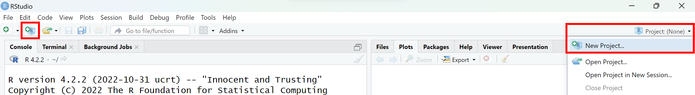
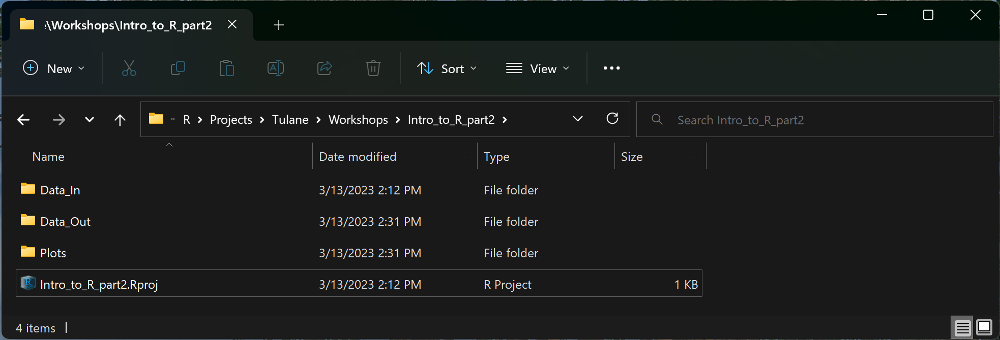
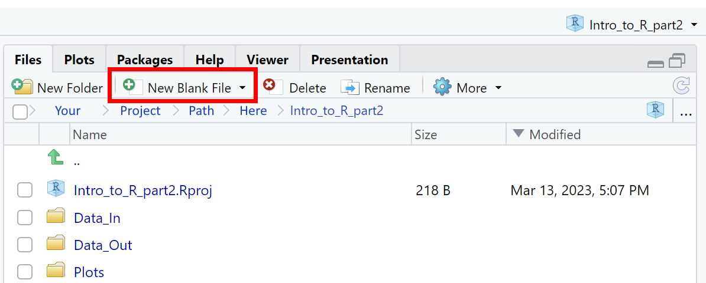
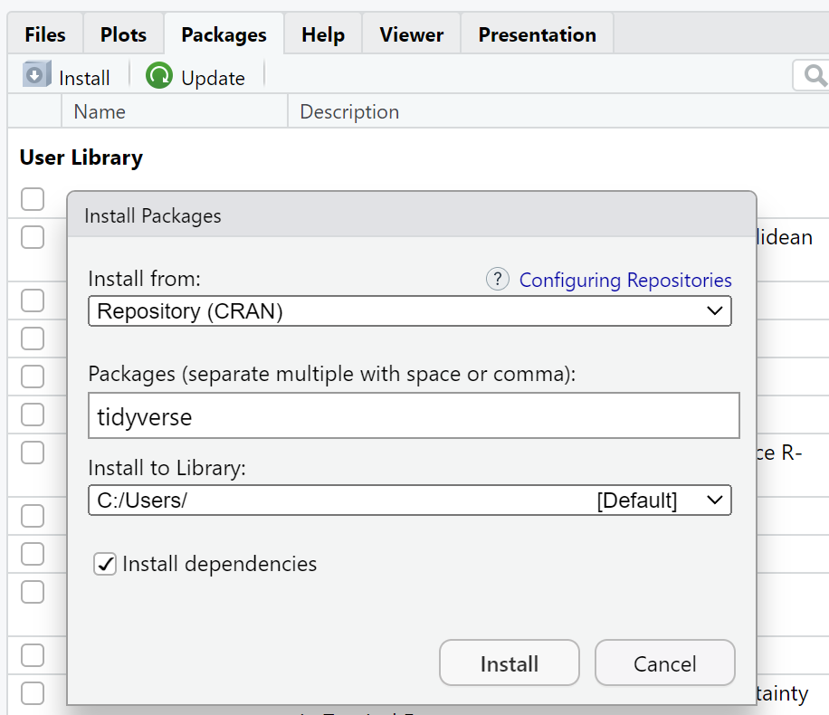

{fig-align="center"}

Welcome! This tutorial was commissioned by Tulane University's Howard-Tilton Memorial Library as the second half of an Intro to R workshop. It is targeted towards faculty, post-docs, graduate students, and undergraduates new to R. In part I, you learned the fundamentals of R and built a foundation for working with your own data. In this second installment, you'll learn to streamline project management, incorporate packages to increase functionality, code more efficiently in the "tidy" dialect, implement more complex conditional and iterative processes, summarize and analyze your data, and visualize your results with figures.

Happy coding!

<br>

# **Projects**

## Create your first project

**Projects** are convenient places to store all of the files associated with whatever it is you're working on in *RStudio*. Bundling up files in projects tends to improve your organizational efficiency, and it streamlines the normal, everyday hassle of importing data and exporting product. Projects are also easily shared with collaborators and save them the headache of replacing your local file paths with their local file paths.

::: callout-tip
## <font size="5"> Try it </font>

<font size="4"> Create a new project to manage materials for this tutorial. </font>
:::

-   *RStudio* Really encourages you to use projects, giving you three easy options to start one. Simply choose "New Project..." from the File drop-down menu, or click one of these two buttons:



-   When creating a new project, you have the option of putting it in a pre-existing folder, in which case it will take the name of that folder, or creating a new folder with the same project name. (You may also see an option to start a new project with version control, which is a more advanced feature beyond the scope of this tutorial).

::: callout-note
## <font size="5"> Note </font>

<font size="4"> This is more advanced, but if you're active on GitHub or hope to be someday, then you'll come to love R projects for smoothly translating to GitHub repositories and vice versa! </font>
:::

-   Choose "New Directory" and then "New Project" to create a folder/project somewhere that makes sense for you. Give it a meaningful but short name like "Intro_to_R\_part2". Don't check any of the optional boxes for now.

-   I recommend keeping your R project folders as organized as possible so you can navigate quickly and share clean work spaces with collaborators since sharing science often means sharing scripts, data, and R output like figures. You may want to consider adding some sub-folders to your project Here's what my setup looks like for this lesson (and most of my R projects):



-   Now that you've created a project, you can always access it using the Project drop-down menu in the right side of *RStudio*. The menu will display the currently open/active project. Check to make sure the project for this tutorial is open to ensure functionality of upcoming code.

-   You can directly access files and folders in your open project through the Files tab in *RStudio*. Very convenient!

## Add R script to project

Great! Now that you've got a project up and running, start a new R script for this tutorial. You can do so using the New File button in the top left, the File drop-down menu, or -- a new option -- the "New Blank File" drop-down menu under your Files tab.



## Add data to project, import

We'll need some data to work on for this tutorial. Let's use the data we created in Part I of this tutorial. If you don't have it handy, you can download it directly from the web using `download.file()`.

When you're working in a Project, R automatically sets it as your working directory! That means you don't have to type out the entire path to access your project folder or the files therein.

::: callout-tip
## <font size="5"> Try it </font>

<font size="4"> Download data from the web directly into your project directory, then import. </font>
:::


::: {.cell}

```{.r .cell-code}
# Setup ----

# First, take a quick look at the help file for download.file()
?download.file

# NOTE: download.file() takes several arguments. We're most concerned with the url, or address of the hosted file for download, and "destfile", or the destination and name you'd like to give the downloaded file.

# NOTE: All of these arguments are text strings and therefore belong in quotations.

# NOTE: You MUST provide a file type in your desired file name (in this case, .csv).
```
:::


You may need to slightly alter the `destfile =` argument depending on whether or not you'd like to store these data in a project sub-folder.


::: {.cell}

```{.r .cell-code}
# I have a sub-folder in my project called "Data_In" and therefore need to specify that location before my chosen file name.
download.file(url = "https://libguides.tulane.edu/ld.php?content_id=71000172", destfile = "Data_In/intro2_bird_data.csv")

# If you don't have a similar sub-folder, you only need to provide destfile with a file name. It will automatically save to your project folder.
download.file("https://libguides.tulane.edu/ld.php?content_id=71000172", "intro2_bird_data.csv")
```
:::


These data should now appear in your *RStudio* files pane. Let's go ahead and import them.


::: {.cell}

```{.r .cell-code}
# Importing data
# Remember to insert or drop a sub-folder as needed.
# This code says "I will create an object named `birds` and assign to it the data contained in the following .csv file stored in my project or specified project sub-folder."
birds <- read.csv("Data_In/intro2_bird_data.csv")
```
:::


Don't forget to scope out your data after importing! I'd recommend entering `View()` into your console. And remember, you've also got...


::: {.cell}

```{.r .cell-code}
head(birds)
tail(birds)
str(birds)
```
:::


# **Packages**

In this tutorial, we're going to do some more complex data munging and analyses requiring specialized functions not included in base *R*. **Packages**, or **Libraries**, are open-source bundles of pre-coded functions (and oftentimes data) that we can install and access in *RStudio* to suit our own needs.

One of the most popular *R* packages is called `tidyverse`. It's actually a collection of packages geared towards making your life *much* easier...at least when it comes to data work. To access it, you need to install it (once) and then load it (once per session when re-opening *RStudio*).

## Installing

::: callout-tip
## <font size="5"> Try it </font>

<font size="4"> Install and load `tidyverse` packages, also known as libraries. </font>
:::

You can view all the packages in base *R* and all the packages you've ever installed by clicking the Packages tab in the *RStudio* pane including your Files and Plots tabs. Do so now, and underneath the tab names, you'll see buttons to Install and Update packages.

::: callout-warning
## <font size="5"> Are you online? </font>

<font size="4"> Most packages are hosted online by *CRAN, The Comprehensive R Archive Network*, so naturally you'll need an internet connection to download and install them! </font>
:::

Click that "Install" button at the top of the pane, type in `tidyverse` in the Packages bar, make sure the "Install Dependencies" box is **checked**, and select the "Install" option in the pop-up window. (For most users, the default library path to install to is a perfectly good option). *RStudio* will then take care of the rest, showing you its progress in your Console pane.

{width="811"}

::: callout-note
## <font size="5"> Note </font>

<font size="4"> Packages are occasionally updated by their creators, often to maintain functionality when *R* or *RStudio* are updated. As a result, you'll have to update your software and/or packages every now and then. When the time comes, you'll typically get warnings from *RStudio* while loading or installing new packages. You can use the Update button at the top of the Packages tab to take care of business. </font>
:::

## Loading

The nice thing about installing packages is that you generally only have to do it once. To *access*, a package, however, you have to tell *RStudio* to open it every time you start a new session. Fortunately, that's quick and easy too. All you have to do is plug the desired package into the `library()` function.

::: callout-note
## <font size="5"> Note </font>

<font size="4"> It's good practice to put code to load libraries, aka packages, in the very beginning of your *script*, not your console! Loading all your required packages up front, not buried halfway through your document can save you and your collaborators from package conflicts down the road. </font>
:::


::: {.cell}

```{.r .cell-code}
# Running library(tidyverse) allows you to access data and functions from the collection of packages that make up the tidyverse.
# Put this somewhere near the top of your script in your Setup section.
library(tidyverse)
```

::: {.cell-output .cell-output-stderr}
```
── Attaching core tidyverse packages ──────────────────────── tidyverse 2.0.0 ──
✔ dplyr     1.1.0     ✔ readr     2.1.4
✔ forcats   1.0.0     ✔ stringr   1.5.0
✔ ggplot2   3.4.1     ✔ tibble    3.2.0
✔ lubridate 1.9.2     ✔ tidyr     1.3.0
✔ purrr     1.0.1     
── Conflicts ────────────────────────────────────────── tidyverse_conflicts() ──
✖ dplyr::filter() masks stats::filter()
✖ dplyr::lag()    masks stats::lag()
ℹ Use the conflicted package (<http://conflicted.r-lib.org/>) to force all conflicts to become errors
```
:::
:::


See those Conflict messages? Those show up because different package creators sometimes use the same word when naming functions with different applications. When calling a function with a conflicting name, e.g., `filter()`, *RStudio* will automatically use the version of the function from the most recently loaded library, in this case `dplyr`, which is part of `tidyverse`. If you want to use a different version of the function in your script, you can specify it by putting the package name in front of two colons and the function title, e.g., `stats::filter(your_data_here)` will override `filter(your_data_here)` from the `dplyr` package after loading `tidyverse`.

# **Enter the Tidyverse**

Great! You can now use the `tidyverse` to create and process "tidy" data, which boils down to making sure your data are organized with one value per cell and one cell per column and row. That way there's no confusion between values contained in a cell or what they mean. This greatly streamlines data workflows.

To learn more about tidy data and the `tidyverse`, do yourself a big favor and explore the resources available at <https://www.tidyverse.org/learn/> and the [RStudio cheatsheets](https://posit.co/resources/cheatsheets/?type=posit-cheatsheets&_page=2/) for tidyverse packages.

-   What is it
-   Vs. "base" R
-   Component packages
-   https://www.tidyverse.org/learn/
-   Pipelines
-   Cheatsheet(s) - from RSTudio? Source?
-   Useful functions

# **Grouping & Summarizing Data**

## `group_by()`

-   example with count or something

## `summarize()`

-   n(), mean(), sd(), min(), max()

# **If/Else Statements**

# **For Loops**

# **T-Tests**

# **Figures in R**

-   r-graphs-gallery
-   ggplot
-   Alternative to boxplots
-   Bar chart
-   Saving/Exporting
